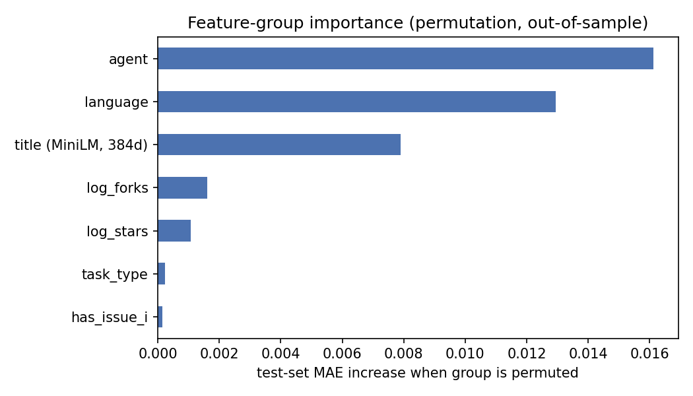
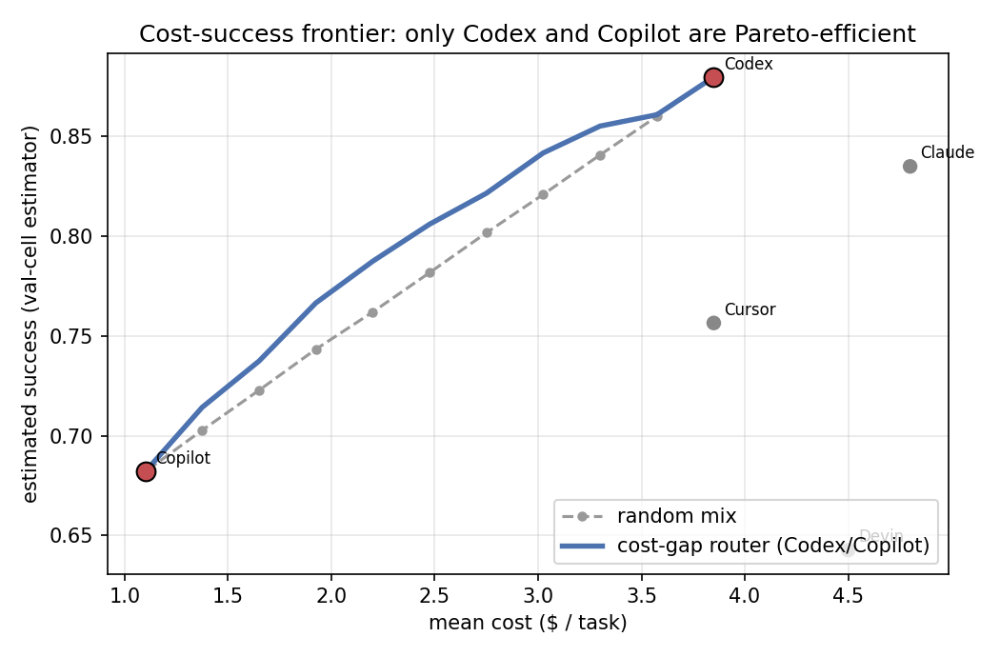
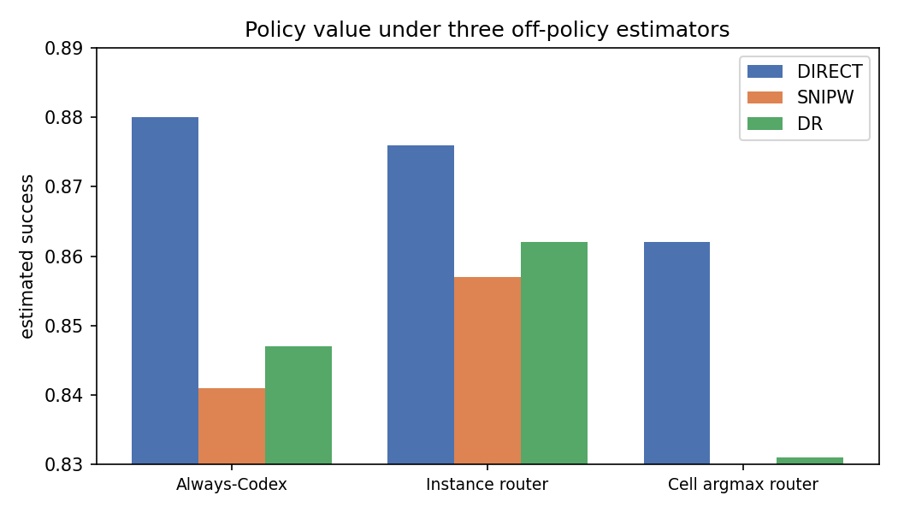

<!--
DRAFT final report (working copy, markdown). Content-first.
Target: ACM proceedings format (acmart), 8-12 pages excl. appendices, due 2026-06-28.
ACM port is built and compiling under tectonic at latex/main.tex (gitignored, ~11pp body + refs).
Remaining HTML-comment TODOs are intentional team-confirm notes in Appendix B only.
-->

# Cost-Aware AgentRouter: A Cheaper Coding-Agent Frontier, and Why the Success Ranking Is Not Identifiable

**Course:** Summer 2026 CSC 504 (Group 13)
**Team:** Ziming Dong, Nhan Huynh, Ming Chen, Jason Thomo

## Abstract

Teams increasingly run several AI coding agents (Codex, Copilot, Cursor, Devin, Claude Code) that differ several-fold in price. We ask whether routing tasks among them can cut cost while preserving merge rate, studied offline on AIDev, a balanced 25,580-PR corpus. We train an XGBoost model with the agent as an input feature and value routing policies with a held-out direct-method off-policy estimator, cross-checked with inverse-propensity, doubly-robust, and two-level-bootstrap estimators. On raw success the per-task ranking of agents is not identifiable: always-best-agent leads under a naive estimator but a learned router leads after deconfounding, and the gap is within estimator noise, because agent deployment is strongly selection-biased (a propensity model predicts the acting agent at 0.36 accuracy against a 0.20 chance level). The usable signal is on the cost axis. Under a normalized per-PR cost scenario and the merge metric, only two of five agents are Pareto-efficient, Codex and Copilot, the latter 2.7 times more successful per dollar; a cell cost-gap router that downgrades well-chosen tasks to Copilot keeps about 93% of the best agent's success (a real, not negligible, loss) at 71% of the cost. The method comparison itself is price-invariant, and the cost-gap router's edge over random and instance baselines is significant under the direct-method and two-level bootstraps (positive but, given the high variance of the deconfounded estimators, not significant under inverse-propensity or doubly-robust reweighting). We frame the result as an observational, reduced-leakage feasibility study and connect it to known hazards of mining GitHub.

## 1. Introduction

AI coding agents such as Codex, Devin, Copilot, Cursor, and Claude Code now routinely open pull requests on public GitHub. Their subscription and usage costs differ several-fold (Section 3.5), yet teams usually pick one agent out of habit rather than per task. We ask whether that choice can be made better, and we frame it as a cost-aware routing problem: given a task, score each agent's expected success and pick the agent that maximizes success net of cost. We study the question offline on AIDev, a large dataset of agentic pull requests.

**Who this is relevant to.** Engineering teams and platform vendors increasingly run several coding agents side by side. If agent quality varies by task and the agents differ in price, a router could cut spend without much loss in merge rate. The same question matters to researchers studying agentic software engineering, because it asks whether observational PR data is even capable of supporting a per-task agent-selection decision.

**What we find.** Routing pays off on cost, not on raw success. Under our cost scenario and the merge metric, only two of the five agents are Pareto-efficient in the cost-success plane (Codex at the high-success end, Copilot at the low-cost end), and a simple cell-level cost-gap router that downgrades well-chosen tasks to the cheaper Copilot keeps about 93% of the best agent's success (a genuine loss, not parity) at 71% of the cost, an advantage that holds under our direct-method and two-level bootstrap checks and stays positive, though not significant, under fully deconfounded estimators (Section 4.3). On raw success, by contrast, the per-task ranking of agents is not even identifiable: always-best-agent leads under a naive estimator but a learned router leads after we adjust for the strong selection in which agent is deployed where, and the difference is within estimator noise. We therefore present the cost-aware router as the usable result, and the success-axis non-identification as the reason that chasing raw accuracy is the wrong objective on observational data. This is an observational, reduced-leakage feasibility study, not a deployable per-task accuracy router.

**Why the model uses no code or PR-body information.** A reader may expect a router to read the diff or the PR description. It cannot. In AIDev the PR `title` and `body` are written by the agent after it acts, so they are post-treatment: they are not available at routing time, and using them leaks the outcome. The point is sharpest for the code diff itself: the diff *is* the agent's output, produced only after an agent has been chosen and has run, so it cannot be an input to the choice that precedes it. Using code information would mean predicting which agent to assign from the work that agent has already done, which is circular by construction. This is why v2 uses no code or diff features at all, only a cleaned task title and repository metadata that exist before any agent acts. Our reduced-leakage feature set (v2) therefore drops the body and every body-derived feature and keeps only the cleaned task title plus repository metadata. This is not only a correctness argument: empirically the task text barely moves accuracy (test MAE 0.306 with text versus 0.309 without, Section 4.2), so the decision is carried by the agent identity and a few repository features, not by code understanding. Section 4.2 makes this concrete with a feature-importance analysis and a model-class comparison, which together answer a natural question raised on the interim report: given how weak these features are, no higher-capacity model is likely to do better.

This report contributes:

- a cost-aware router for AI coding agents and the cost-success frontier it traces: under our cost scenario and the merge metric only Codex and Copilot are Pareto-efficient, and a cell cost-gap router keeps about 93% of the best agent's success at 71% of the cost (Section 4.3);
- evidence that the success-axis ranking is not identifiable on observational data, flipping between naive and deconfounded estimators and dominated by selection bias and a self-merge workflow rather than agent capability (Sections 4.4 to 4.5);
- a model-class and feature-importance analysis showing the task is signal-limited, so neither a higher-capacity model nor any code or PR-body feature helps (Section 4.2);
- the supporting pipeline (a balanced 25,580-PR corpus, an XGBoost model with agent-as-input, and a battery of off-policy estimators) and a methodological reading connecting the result to known pitfalls of mining GitHub (Section 5).

Research questions:

- **RQ1.** Do the five agents show measurably different merge rates across task categories?
- **RQ2.** How accurately can a regressor predict per-agent success from task and repository proxy features, and does model capacity change that?
- **RQ3.** Can a cost-aware router improve the cost-quality trade-off over always-best-agent, and which routing signal achieves it?

## 2. Related Work

Our work sits at the intersection of cost-aware model routing and empirical studies of AI coding agents, and it leans methodologically on off-policy evaluation and on the literature about the hazards of mining repository data. In one line: the routing literature chooses among **models** on benchmark inputs with near-counterfactual labels, the AIDev literature **describes** agents without treating the choice as a decision, and we sit in the gap, learning and valuing a choice among whole commercial **agents** from purely observational GitHub outcomes. We organize prior work along these threads and situate our approach against the closest systems.

### 2.1 Cost-aware routing among LLMs and agents

The closest precedents route queries among general-purpose models of differing cost and quality. **RouteLLM** [Ong et al. 2025] learns a binary router between a strong and a weak model from preference data; **Hybrid LLM** [Ding et al. 2024] casts it as quality-aware routing between a small and a large model; and **FrugalGPT** [Chen et al. 2024] cascades models, stopping at the cheapest one whose answer passes a learned scorer. The idea has since broadened into reward-guided routing (**Zooter** [Lu et al. 2024]), graph-based performance-cost prediction (**GraphRouter** [Feng et al. 2025]), explicitly cost-aware rate-optimal routing with theoretical guarantees (**CARROT** [Somerstep et al. 2025]), dynamic cost-quality routing over mixed model pools (**MixLLM** [Wang et al. 2025]), dedicated benchmarks (**RouterBench** [Hu et al. 2024]), and surveys of LLM ensembling [Chen et al. 2025] and of dynamic routing and cascading [Moslem and Kelleher 2026]. All report the same headline: a learned router beats an "always use the strongest model" policy on the cost-quality trade-off. Even work titled for agents, such as model-and-agent orchestration [Guo et al. 2025], in practice still routes among models on benchmark tasks.

We adopt RouteLLM's formulation, a learned policy over input features that selects among candidates to maximize utility net of cost, and re-target it from model selection to **agent** selection at the level of a GitHub task. Two structural differences separate our setting and drive our different result. First, those systems route over a **shared input**: the same query can in principle be sent to any model, and overlapping or preference-labeled responses give a near-counterfactual signal. AIDev is purely observational, one agent per task with essentially no overlap (Section 3.6), so the routing signal must be estimated off-policy and, as we show, the success-axis ranking is not even identifiable (Section 4.5). Second, those works evaluate on short-form QA, summarization, and reasoning, whereas a coding agent's task is long-horizon and its success label (merge) is a workflow-confounded proxy, not a graded answer. To our knowledge no prior work frames the choice among whole commercial coding agents as a cost-aware routing problem learned and valued on observational deployment data; that gap is what we target.

### 2.2 AI coding agents and their evaluation

A parallel line evaluates coding agents directly. **SWE-bench** [Jimenez et al. 2024] measures whether a system resolves real GitHub issues and has become the standard counterfactual benchmark, with leaderboard infrastructure such as the Holistic Agent Leaderboard [Kapoor et al. 2025] running many systems on the same curated tasks. Cost is now a first-class concern here: an early-termination method cuts the spend of a *single* SWE agent by abandoning unpromising trajectories [Guo et al. 2026], and task-level evaluations compare agents head-to-head on shared open-source tasks [Rahman et al. 2026]. The **SE 3.0** vision [Li et al. 2025] frames agents as first-class teammates, and field experiments such as Cui et al. [2024] estimate the productivity effect of generative AI on developers with a randomized design. All of these either optimize cost *within* one agent, rank agents on *shared* tasks with counterfactual overlap, or (in Cui et al.'s case) randomize agent access in a live experiment; none routes among already-deployed agents on observational data. Cui et al. in fact sharpens our motivation: a randomized live comparison is the gold standard but is expensive and rarely available, which is exactly why we ask what an observational corpus can yield. Our study is the complement: what can be learned about agent choice when only observational deployment outcomes are available.

### 2.3 Empirical studies on agentic pull requests (AIDev)

The **AIDev** dataset [Li et al. 2026], 932,791 agentic pull requests across five agents, has supported a wave of empirical studies: the security of agent-authored PRs [Siddiq et al. 2026], whether agents contribute tests [Haque et al. 2026], why agentic fixes get rejected [Abujadallah et al. 2026], and task-level agent performance in open-source projects [Rahman et al. 2026]. This work describes *what* agents do and *how well* they do it, but treats agent identity as a descriptive variable. We instead treat the agent as the quantity to be chosen, which turns the dataset from a description into a decision problem and at once exposes how strongly the apparent quality ranking is confounded by where each agent is deployed (Section 4.4). This step, from describing agents to routing among them under cost, is the main way our scope extends the AIDev studies we build on.

### 2.4 Off-policy and counterfactual evaluation

Because each task is attempted by a single agent, valuing a routing policy is an off-policy evaluation problem. The standard estimators are the direct method (fit an outcome model and average its predictions under the new policy), inverse propensity weighting (IPW), and the doubly robust combination [Dudík et al. 2011], developed for contextual-bandit policy evaluation. We use a subgroup **direct-method** estimator: per-(language × task_type) cell success scored on held-out cells (Section 3.6). This inherits the direct method's known weakness, sensitivity to outcome-model and exchangeability assumptions, which is why we report it as within-distribution rather than causal and cross-check it with IPW and doubly-robust estimators with bootstrap intervals (Section 4.5).

### 2.5 Defect and merge prediction in mining software repositories

A methodologically adjacent line predicts per-commit or per-PR outcomes. Ni et al. [2022] predict just-in-time defects without modeling which author produced the change. The nearest neighbour is pull-request acceptance prediction, where the outcome we model (merge) is itself the dependent variable: Gousios et al. [2014] characterize the pull-based development model and the factors behind acceptance, and Tsay et al. [2014] show that both social and technical factors shape whether a contribution is merged. Our contribution to this thread is to add agent identity as a feature and show that, once it is present, merge behaves as a noisy and confounded label dominated by per-agent base rates and by who reviews the PR rather than by task content.

### 2.6 Pitfalls of mining GitHub

Mining GitHub for outcome data carries well-documented hazards. Kalliamvakou et al. [2016] catalog perils of mining GitHub, including non-representative samples and repositories whose recorded activity does not mean what it appears to; Menzies and Shepperd [2019] catalog analogous "bad smells" in software-analytics studies. Our selection-bias finding is a concrete instance: the agent that looks best is simply the one most often used in easy, low-star, self-merge repositories, so an uncritical mining of merge rates would read a usage pattern as a capability ranking. We return to this as the study's main methodological lesson (Section 5).

## 3. Research Questions and Methodology

We study three questions: whether the five agents differ in merge rate across task categories (RQ1), how well per-agent success can be predicted from task and repository proxy features and whether model capacity changes that (RQ2), and whether a cost-aware router improves the cost-quality trade-off over an always-best-agent policy and which routing signal achieves it (RQ3). We answer them offline on observational deployment data rather than through an online A/B test, for three reasons. First, an online test that splits live traffic across five commercial agents is expensive and slow, and is not available to us. Second, observational deployment data already exists at scale (AIDev), so the offline setting is the one a team would realistically start from before committing to any live experiment. Third, the offline setting is itself the object of study: a central question of this paper is exactly how far an observational PR corpus can support a per-task agent-selection decision, and answering that requires working within its constraints rather than designing them away. The price of this choice is that each task is attempted by a single agent, so the routing signal must be recovered off-policy and the success-axis comparison is only as trustworthy as the deconfounding (Sections 4.4 to 4.5); we treat that exposure as a finding rather than hide it.

The methodology that follows is shaped by these constraints. We restate the research questions above and justify the main choices in turn: a balanced multi-agent corpus so that minority agents are learnable and agent frequency does not dominate the model (Section 3.1), a graded regression target and an MAE metric chosen to match the censored outcome (Section 3.2), a deliberately reduced-leakage feature set that excludes the post-treatment PR body (Section 3.3), a single regressor with agent-as-input so the agent contrast is read off by swapping one feature (Section 3.4), a normalized per-PR cost scenario (Section 3.5), and an off-policy estimator scored on held-out cells with a battery of cross-checks (Section 3.6).

### 3.1 Dataset

We use AIDev [Li et al. 2026], read through DuckDB. We build the corpus from the full dump of about 932k agent PRs rather than the smaller "pop" subset, which holds too few minority-agent PRs to train a 5-agent router (Claude_Code has 459, Cursor 1,541). The build steps:

1. Filter to the five agents; require a `repo_id` and non-empty task text.
2. Label each PR from `state` and `merged_at` (Section 3.2).
3. Join repository metadata (`language`, `forks`, `stars`).
4. Derive `task_type` (a conventional-commit rule on the title), `has_issue` (`related_issue` linkage), and a partially stripped `body_clean` (footers, URLs, and agent tokens removed, but emails and some tool names remain; used only in the v1 leaky analysis).
5. Balance by down-sampling each agent to the smallest count (Claude_Code, 5,116), giving **25,580 PRs, 5,116 per agent**. Down-sampling keeps each agent's natural outcome distribution, which carries the routing signal, while removing the agent-frequency imbalance that would otherwise dominate a classifier.

Built by `build_router_dataset.py`, written to `data/router_dataset.jsonl`.

**Why balance, and why the full dump.** A 5-agent router cannot learn minority agents from the pop subset (hundreds of PRs for the thinnest agents). Down-sampling the full dump to a per-agent floor is the imbalanced-data remedy of choice here [He and Garcia 2009]; it trades raw volume so that agents can be compared on equal footing. We undo the down-sampling when we need the real-world usage mix, for the most-popular baseline (Section 4.5).

***Figure 1.** Outcome distribution per agent (balanced corpus). Per-agent merge rates vary widely (Codex 87.6%, Claude 77.0%, Cursor 72.6%, Devin 64.6%, Copilot 58.6%), and the still-open versus closed-unmerged structure varies with them (Devin 30% closed-unmerged; Copilot 21% still-open), which points to differing workflows.*

| split (repo-grouped 70/15/15) | rows |
|---|---|
| train | 18,188 |
| val | 3,497 |
| test | 3,895 |

### 3.2 Labels and metric choice

We model a regression target `success in {merged: 1.0, still_open: 0.3, closed_unmerged: 0.0}`. We chose a graded regression target over a binary one so that a still-open PR is not silently scored as either a success or a failure, and we report mean absolute error (MAE) so that the metric is on the same 0-1 scale as the target and is robust to the heavy mass at the extremes.

*Limitation (revisited in Section 6):* `still_open` is right-censored rather than "0.3 of a success", and open-rates differ by agent, so the 0.3 heuristic can bias the agent ranking. We test robustness at both extremes of the heuristic, a binary `merged` target (still-open scored as 0) and the opposite coding (still-open scored as 1.0); the conclusions hold under both (Section 4.6), so the 0.3 value is not driving them. A full right-censored (survival) treatment of `still_open` is left to future work (Section 7).

### 3.3 Features (two regimes)

The AIDev `title` and `body` are the agent-authored PR, produced after the agent acts. They are post-treatment and not available at routing time, so we report two feature regimes:

- *v1 (initial, leaky).* An earlier version used the PR title plus `body_clean` (frozen MiniLM embeddings, chunked for long text), body-derived difficulty (length, code-block count, stack-trace flag), repo metadata, and `task_type`. This regime contains post-treatment leakage, which is what motivated v2.
- *v2 (reduced-leakage, `05_router_pretreatment.ipynb`).* Drops the PR body and every body-derived feature; it uses the cleaned `title` (agent tokens stripped) as a reduced-leakage task proxy, plus repo metadata (`language`, log `stars`, log `forks`), `has_issue`, and `task_type`. The title is itself agent-authored, so this is reduced-leakage rather than strictly pre-treatment.

In both regimes the agent identity is an input one-hot feature, not the prediction target. All results outside the explicit v1 ablation use v2.

### 3.4 Model and routing

A single XGBoost regressor learns `f(task features, agent) -> success`, an implicit table `P(success | task, agent)`. We use one model with agent-as-input rather than five per-agent models so that the task features are shared and the agent contrast is read off directly by swapping one feature. To route, we score all five agents for a task, holding the base features fixed and swapping only the agent one-hot, then pick an agent. The success-only policy picks `argmax_a P(success | x, a)`; the cost-aware policy picks `argmax_a [ P(success | x, a) - lambda * cost(a) ]`.

The XGBoost configuration (800 trees, depth 6, learning rate 0.05, subsample and column-subsample 0.8, `min_child_weight` 5, early stopping on the validation split) is held fixed across experiments. We tune the linear and neural baselines on the validation split in Section 4.2; because a linear model already matches XGBoost there, a wider XGBoost search is unlikely to move the ceiling.

The cost-aware objective is conceptual here. Copilot is the only agent cheaper than Codex, so the reported frontier is a Codex-to-Copilot budget sweep (an increasing fraction of tasks moved to Copilot) rather than a literal five-agent lambda grid.

We compare two signals for choosing *which* tasks to move. The **instance router** uses the XGBoost model's per-task estimate. The **cell** signal uses a per-(language × task_type) estimate of each agent's historical success, and we apply it two ways: a success-only **cell argmax router**, and a **cell cost-gap router** that ranks tasks by the cell's Copilot-minus-Codex success gap (Section 4.3). We also ran an encoder ablation (MiniLM, mpnet, and a code-aware model) and tested per-agent calibration (Section 4).

The routing policies and baselines compared throughout are:

| routing policy | how it chooses an agent |
|---|---|
| **Always-best (Codex)** | always the highest historical-success agent |
| **Always-cheapest (Copilot)** | always the cheapest agent (the cost anchor) |
| **Random** | a random agent |
| **Most-popular** | the agent most used for the task's cell in the real-world distribution |
| **Instance router** | argmax of the XGBoost per-task success estimate |
| **Cell argmax router** | argmax of the cell's historical per-agent success |
| **Cell cost-gap router** | moves the tasks whose cell has the smallest Copilot-minus-Codex success gap |

***Table 1.** Routing policies and baselines compared throughout the report.*

### 3.5 Cost model

The five agents bill on different bases (token API for Codex and Claude, request/credit for Copilot, ACU for Devin, a backend-model pool for Cursor), so we use a **normalized marginal per-PR cost scenario** rather than exact vendor billing. Token-priced agents are sized by an agentic-PR budget (600k input, 200k output) at public API rates; the rest are mapped to an approximate per-PR cost:

| agent | Copilot | OpenAI_Codex | Cursor | Devin | Claude_Code |
|---|---|---|---|---|---|
| $ / PR | 1.10 | 3.85 | 3.85 | 4.50 | 4.80 |

Basis: Codex from GPT-5.3-Codex ($1.75 / $14 per MTok); Claude from Sonnet ($3 / $15); Cursor is backend-model dependent, with the base using a Codex-class rate; Devin is two ACUs at $2.25; Copilot uses its request/credit pricing.

*Limitations:* these are scenario costs, not exact billing. The token-priced values depend on the budget assumption and the request/ACU/backend-priced ones on the billing model, and we do not scale cost by task size (the `log(forks)` proxy collapses because 74% of repos have zero forks). The pricing scenario does not, however, threaten the central method comparison: a policy's estimated success at a given routing fraction does not depend on the dollar values, so any change of cost scenario only rescales the cost axis and leaves the cost-gap router's advantage over the random and instance baselines unchanged (Section 4.3). What the scenario does affect is which always-agent points sit on the Pareto frontier; we report the implied per-agent break-even prices in Section 4.3 and leave a full token-budget sensitivity sweep to future work (Section 7).

### 3.6 Splits and evaluation

Splits are grouped by `repo_id` so that no repo crosses train, validation, or test, and all encoders are fit on the training split only.

Instance-level counterfactual evaluation is impossible here. In `related_issue`, only **5 issues** were attempted by two or more distinct agents, so we almost never observe two agents on the same task. We therefore use a subgroup direct-method estimator. We estimate each agent's success per (language × task_type) cell on the **held-out validation** cells, then use those estimates to value each policy's test-set choices. Scoring on validation cells, rather than on the training cells that the cell-based router routes by, makes the estimate **less circular**. It is not fully independent, since the model's early stopping also uses validation.

We quantify sampling uncertainty with a paired bootstrap over test rows (2,000 resamples). Because the direct-method estimator is itself assumption-laden, we cross-check every headline policy value three ways: a self-normalized IPW estimator and a doubly-robust estimator built on a covariate propensity model (Section 4.4), and a two-level bootstrap that resamples the validation estimator as well as the test set (Section 4.5). All splits here are random over repositories; a time-based split (train on past PRs, test on future ones) that would test temporal drift is left to future work (Section 7).

We evaluate the routers against four baselines: **random**, **always-cheapest** (Copilot), **most-popular** (the agent most used for the task's cell, reconstructed by undoing the per-agent down-sampling), and **always-best-agent** (Codex).

## 4. Findings

### 4.1 RQ1: agents differ by task category

Merge rates differ sharply across agents (Figure 2). Across the eight most common task types, Codex ranges from 84% to 89%, against 48% to 66% for Copilot, so RQ1's premise, that the agents are not interchangeable, holds. The leader barely changes with granularity: Codex has the highest merge rate in each of those eight task types. Only small or fine-grained slices favour another agent (tiny task categories such as `perf` or `chore`, or a minority of (language × task_type) cells), and that edge is small and does not survive out-of-sample (Sections 4.5 and 4.6). The heterogeneity is real in level but weak as a routing signal, which Section 4.4 ties to selection bias.

***Figure 2.** Merge rate by agent across the eight most common task types. Codex has the highest merge rate in each; the gap to the other agents is wide, and the leading agent does not change across these categories.*

### 4.2 RQ2: per-agent success is only marginally predictable, and capacity does not help

The model barely beats a per-agent-mean baseline, and encoder capacity or type does not help. The encoder ablation below runs under the **leaky v1 feature set** (it includes the post-treatment PR body, so these MAEs are optimistic):

| v1 leaky encoder ablation | test MAE |
|---|---|
| MiniLM | 0.305 |
| mpnet-base (110M) | 0.307 |
| code-aware (st-codesearch) | 0.297 |

Even with that leakage the best encoder (0.297) barely improves on the per-agent-mean baseline below, and encoder type or size hardly moves it. The honest, **reduced-leakage v2** model is what we report everywhere else:

| reduced-leakage v2 model | test MAE |
|---|---|
| per-agent-mean baseline | 0.331 |
| v2 (cleaned title + repo) | 0.306 |
| v2 (repo metadata only, no text) | 0.309 |

*Takeaway:* the predictive power comes from the agent identity and the repository's primary language; the task text contributes little (dropping it moves MAE only from 0.306 to 0.309), and bigger or code-aware encoders do not change that. The ceiling is the data signal, not the model, as the next two analyses confirm.

**No model class does better on these features.** The interim feedback asked which models are likely to do better given only these features. We compare a capacity ladder on the v2 (title + repo) feature set, tuning the linear and neural models on the validation split:

| model (v2 title+repo features) | test MAE |
|---|---|
| per-agent-mean baseline | 0.331 |
| Ridge (linear) | 0.306 |
| small MLP (128, tuned) | 0.350 |
| XGBoost (tuned) | 0.306 |

A linear model already reaches the tuned-XGBoost MAE of 0.306, and a small multilayer perceptron does no better (0.350, even after a small validation grid over width and regularization). Capacity is not the bottleneck: the problem is signal-limited, so a higher-capacity model is not expected to help.

**What the router actually uses.** Figure 7 reports feature-group importance by permutation on the test set (the out-of-sample MAE increase when a group is jointly shuffled), which, unlike split gain, is not biased by how many columns a group has. The agent one-hot is the largest contributor (+0.016 MAE), then repository language (+0.013) and the 384-dimension title embedding (+0.008); `log_stars`, `log_forks`, `task_type`, and `has_issue` are near zero. Split gain tells a misleading story: the title block absorbs 84% of total gain only because it has 384 high-cardinality columns, yet permutation and the ablation agree it carries almost no out-of-sample value. We treat this gap between in-sample gain and out-of-sample importance as a small cautionary example of why gain-based importance should not be read as predictive value.

***Figure 7.** Feature-group importance by permutation on the test set (MAE increase when each group is jointly shuffled). Agent identity and repository language dominate; the title embedding adds little and the remaining repository features almost nothing, consistent with the text ablation (0.306 to 0.309).*

### 4.3 RQ3: a cell cost-gap router improves the cost-quality frontier

On success alone, no learned router beats always-best-agent. Under the held-out validation-cell estimator, the instance router scores 0.876 and the cell argmax router 0.862, both below always-Codex at 0.880. A text-free model collapses to always-Codex, and dropping the leaked body features left test MAE essentially unchanged at 0.306, so the task text was never carrying the decision. The value of routing is therefore on the **cost** axis.

Saving cost means sending some tasks to the only cheaper agent, Copilot, at $1.10 against Codex's $3.85. Copilot is weaker on average, so the question is *which* tasks to send. We compare three ways to choose, scored at matched cost (Figure 3):

- **random mix** sends a random fraction to Copilot;
- **instance router** sends the tasks the XGBoost model rates closest between the two agents;
- **cell cost-gap router** sends the tasks whose (language × task_type) cell has the smallest historical Copilot-minus-Codex gap, that is, the cells where the cheap agent loses least.

| mean cost | random | instance router | cell cost-gap router |
|---|---|---|---|
| $3.85 (always-Codex) | 0.880 | 0.880 | 0.880 |
| $3.30 (14% cheaper) | 0.841 | 0.839 | **0.855** |
| $2.75 (29% cheaper) | 0.801 | 0.803 | **0.821** |
| $2.20 (43% cheaper) | 0.761 | 0.763 | **0.787** |

***Figure 3.** Estimated success at matched cost (held-out validation-cell estimator). The instance router is no better than a random mix, because the text signal is too weak to pick tasks. The cell cost-gap router buys about two extra points of success at every cost level (for example 0.821 against 0.803 at 29% lower cost). The frontier still slopes down, so cost savings come at a real success cost, but the cell cost-gap router gives the best available trade-off.*

In cost-versus-best terms, the cell cost-gap router keeps about **93% of always-Codex's success** (0.821 against 0.880) **at 29% lower cost** ($2.75 against $3.85), and about 97% (0.855) at 14% lower cost.

We test this edge against three increasingly demanding uncertainty models, and report the result honestly rather than claiming uniform robustness. Under a paired bootstrap over test rows (2,000 resamples) with the direct-method estimator, at all three cost levels the cell cost-gap router beats both the random mix and the instance router, with paired-difference 95% confidence intervals of about +1.3 to +2.7 points that exclude zero (at 29% cheaper: cost-gap minus random +0.022, 95% CI [+0.016, +0.027]; cost-gap minus instance +0.019, [+0.013, +0.025]). The edge also survives a two-level bootstrap that resamples the validation estimator as well as the test set, though more narrowly (cost-gap minus random +0.023, 95% CI [+0.003, +0.044]; cost-gap minus instance +0.020, [+0.001, +0.040]). It is weaker under the deconfounded estimators: the cell cost-gap router still has the highest point value of the three cost-saving policies under self-normalized IPW and doubly-robust estimators, and the point difference stays positive (about +0.03 over the random mix), but those estimators are high-variance here (Kish effective sample size 375 to 525 of 3,895 test rows, Section 4.5) and the paired-difference CI then includes zero (IPW cost-gap minus random +0.03, 95% CI [-0.01, +0.08]). So the cost-axis advantage is significant under the direct-method and two-level bootstraps and positive but not significant under IPW/DR. It is the most robust finding in the paper, and the only one that stays significant under the stricter two-level resampling, but it loses significance under the deconfounding IPW/DR estimators, so we stop short of claiming significance under every estimator.

The cost-gap signal also earns its place against a non-learned difficulty proxy, which addresses a natural worry that the router is just "downgrade the tasks that look easy for the cheap agent". Ranking tasks by Copilot's own historical cell rate alone, ignoring Codex, reaches 0.811 at 29% lower cost; the cost-gap router, which ranks by the Copilot-minus-Codex difference, reaches 0.821. The +0.011 paired difference (95% CI [+0.007, +0.015]) is small but excludes zero, so subtracting the Codex rate is doing real work: the router is keying on where Copilot loses *least relative to Codex*, not merely on where Copilot looks good in isolation.

**Which agents are worth routing to.** Seen as a cost-success trade-off (Figure 9), under this pricing scenario and the merge metric only two of the five agents are Pareto-efficient: Codex at the high-success end and Copilot at the low-cost end. Cursor, Devin, and Claude are cost-dominated here, each with a lower estimated merge rate than Codex at an equal or higher price. This is a conditional statement, not a verdict that the three agents are uncompetitive, and two things keep them in play. Cursor is priced identically to Codex (Section 3.5) yet is at least as clean once self-merge is controlled for (Section 4.4), and under a success metric that credits only externally reviewed merges it does re-enter the frontier in Codex's place (Section 4.4, Table 3); the dominance also rests on the cost scenario, which is itself an assumption (Section 3.5). On the merge metric the efficiency gap is nonetheless large: as success per dollar, Copilot returns 0.62 against Codex's 0.23, a 2.7-fold difference. The cost-gap router is the efficient operating curve between the two merge-metric anchors, and a naive five-agent policy that penalizes cost in an argmax over all agents is dominated by it (0.809 against 0.821 at $2.75). So under current pricing and the merge metric the practical router reduces to a two-agent rule (stay on Codex, downgrade the least-costly tasks to Copilot), but whether the menu is genuinely binary depends on the success metric and the prices, not on the other agents being inherently weak.

Quantifying the price side, a cost-aware router would begin to select one of the dominated agents only after a steep price cut. Holding merge success fixed, Cursor would have to fall to about 55% of its current per-PR price to enter the frontier, Claude to about 67%, and Devin to about 24% (below even Copilot's price). The method comparison itself is price-invariant: a policy's success at a given routing fraction does not depend on the dollar values, so changing the pricing scenario only rescales the cost axis and leaves the cost-gap router's advantage over the random and instance baselines unchanged.

***Figure 9.** Estimated success against mean cost for the five always-agent policies (points; Codex and Copilot, circled, are the only Pareto-efficient ones) and the cost-gap router (curve). The router trades along the Codex-to-Copilot edge; the other three agents sit inside the frontier and are never cost-effective.*

### 4.4 Why always-Codex is so strong: selection bias and review intensity

always-Codex simply inherits Codex's high observed success (87.6% merged, Figure 1), the highest of the five and highest in nearly every cell. This is largely selection bias rather than proven capability (Figure 4):

***Figure 4.** 99% of Codex PRs sit in `<500★` repos (and none in `>5k★`), exactly where merge rates are highest for every agent. Codex's fast self-merge outcome structure (88% merged, 6% closed) contrasts with Copilot's formal-review pattern (21% still-open). The lead persists under star-difficulty adjustment (Codex's merge rate is about 14 percentage points above the rate expected from its PRs' repo-popularity buckets), so the confound is more likely the unobserved self-merge workflow than repo popularity alone.*

**The selection is large enough to measure.** A propensity model that predicts the acting agent from repository and task features alone (no text, no agent) reaches 0.36 accuracy against a 0.20 chance level, so which agent handles a task is substantially determined by where the task sits. When we reweight each agent's success to a balanced covariate distribution with inverse-propensity and doubly-robust estimators (Section 4.5), always-Codex's estimated value falls from 0.880 to about 0.847. These reweighted estimators are honest but high-variance: the Kish effective sample size is 375 to 525 of the 3,895 test rows, so their confidence intervals are wide (Section 4.5). A large part of Codex's apparent lead is therefore an artifact of where it is deployed, not how well it performs.

**The advantage is review-driven.** Changing the quality metric exposes the same confound. On the pop subset (which carries review data), Codex also looks strongest on several raw diagnostics (clean-merge rate, changes-requested rate, review burden, commit count), but these diagnostics are review-confounded: 89% of its PRs are never reviewed (self-merged), against 46 to 58% for the others, and an unreviewed PR cannot accumulate changes-requested. Restricting to PRs that *were* reviewed, Codex's edge collapses and Cursor is at least as clean (Figure 5):

| changes-requested rate | all PRs | reviewed PRs only |
|---|---|---|
| Cursor | 0.019 | **0.039** |
| Codex | 0.005 | 0.047 |
| Claude | 0.033 | 0.079 |
| Devin | 0.047 | 0.106 |
| Copilot | 0.122 | 0.226 |

***Figure 5.** Among reviewed PRs, Codex no longer leads: Cursor has the lowest changes-requested rate (0.039 against Codex's 0.047, within noise). Codex's raw "quality" is an artifact of 89% of its PRs going unreviewed.*

So the agent ranking depends on the quality metric, and the dependence is sharp enough to change which agents are economically efficient. Table 3 recomputes the cost-success Pareto set (Section 4.3) on the pop subset under three success metrics. Under raw merge, and even under cleanliness among reviewed PRs, Codex stays Pareto-efficient: its reviewed PRs are in fact the cleanest (0.749 merged with no changes requested). But Codex is reviewed only 11% of the time, so under a metric that credits only externally validated merges (merged, reviewed, and no changes requested), Codex collapses to 0.081 and leaves the frontier, and Cursor, at the same price as Codex, takes its place. Whether the cheap unreviewed self-merge workflow counts as success therefore decides not only the ranking but which agents a cost-aware router would ever use.

| success metric | Pareto-efficient agents | note |
|---|---|---|
| raw merge | Codex, Copilot | Codex 0.83 dominates the mid-price agents |
| clean among reviewed PRs | Codex, Copilot | reviewed Codex is the cleanest (0.749) |
| merged + reviewed + no changes requested | Cursor, Copilot | Codex exits (0.081; only 11% of its PRs are reviewed) |

***Table 3.** Pareto-efficient agents in the cost-success plane under three success metrics (pop subset). The premium anchor flips from Codex to Cursor once the metric requires external review, because Codex's apparent quality rides on self-merge. Devin and Claude are dominated under every metric. Per-agent pop-subset PR counts (and reviewed fraction): Codex 21,799 (11% reviewed), Copilot 4,970 (54%), Devin 4,827 (45%), Cursor 1,541 (50%), Claude 459 (42%); the strict-metric figures for the thinner agents rest on a few hundred reviewed PRs and are descriptive, not a per-task signal.*

We treat this as directional rather than conclusive: it is the pop subset, review coverage is sparse and non-random (about 11% of PRs, and only 3.9% of our balanced corpus), and per-agent counts range from 459 to 21,799, so the data support an aggregate comparison but not a per-task quality-aware router.

### 4.5 Baselines: "best" and "most-popular" are the same agent

A richer baseline suite (Table 2, Figure 6) shows that the always-best-agent baseline is numerically close to a most-popular one. The most-popular baseline routes each task to the agent most frequently used for its (language × task_type) cell in the real-world distribution, reconstructed by undoing the per-agent down-sampling. It sends 99% of tasks to Codex and scores 0.879, essentially equal to always-Codex at 0.880. In other words, the most-used agent and the most-successful agent are the same agent.

Under the direct-method estimator neither learned router exceeds it: the instance router scores 0.876 and the cell argmax router 0.862, and both occasionally route to pricier agents, so they cost slightly more than always-Codex (Table 2). Always-cheapest (Copilot) anchors the cheap end at 0.682 and $1.10.

The apparent always-Codex lead, though, is not robustly identified, for two reasons. First, it is fragile to estimator uncertainty: a two-level bootstrap that resamples the validation estimator as well as the test set widens the intervals until the Codex-minus-instance gap is no longer significant (+0.004, 95% CI [-0.000, +0.007]). Second, it is fragile to confounding: reweighting for the propensity of agent deployment (Section 4.4) with self-normalized inverse-propensity (IPW) and doubly-robust (DR) estimators pulls always-Codex down from 0.880 to 0.841 and 0.847 and puts the instance router slightly ahead (0.857 and 0.862; Figure 8). The spread across estimators (about four points) is larger than the gaps between policies (one to two points). We therefore do not claim that always-Codex beats the learned routers, nor that the routers beat it: on the success axis the observational data cannot resolve the ranking. The propensity model's overlap is adequate (only 0.1% of test rows have a below-floor deployment probability for the agent that actually acted, and 1.7% of all agent-cell propensities are clipped), so the wide IPW/DR intervals reflect genuine reweighting variance rather than a handful of extreme weights. What remains comparatively solid is the relative cost-axis result of Section 4.3, which is significant under the direct-method and two-level bootstraps; under the same high-variance IPW/DR estimators its edge stays positive but, like the success-axis gaps, loses significance.

| baseline | success (95% CI) | mean $ | Codex share |
|---|---|---|---|
| Always-cheapest (Copilot) | 0.682 [0.677, 0.687] | 1.10 | 0% |
| Random | 0.759 [0.753, 0.764] | 3.65 | 20% |
| Cell argmax router | 0.862 [0.857, 0.866] | 3.99 | 77% |
| Instance router | 0.876 [0.872, 0.879] | 3.92 | 92% |
| Most-popular (raw usage) | 0.879 (point) | 3.83 | 99% |
| Always-best (Codex) | 0.880 [0.876, 0.883] | 3.85 | 100% |

***Table 2.** Success-only routing, scored on the held-out validation-cell (direct-method) estimator. No learned router beats always-Codex under this estimator, but the ranking is estimator-dependent: under IPW and doubly-robust estimators the instance router edges ahead (Figure 8). The cell argmax router's value shows up only under cost pressure (Section 4.3). An in-sample cell oracle reaches 0.93 but is circular (Section 4.6).*

***Figure 6.** Success-only routing (held-out validation-cell estimator). Always-best (Codex) and most-popular coincide at about 0.88 (both route about 99% to Codex), so the strong baseline conflates quality with popularity. Under this estimator no learned router beats it; under deconfounded estimators the ranking flips (Figure 8).*

***Figure 8.** Success value of the three routing policies under three off-policy estimators (direct method, self-normalized IPW, doubly-robust). The direct method ranks always-Codex first; after reweighting for agent-deployment propensity, IPW and DR rank the instance router first. The disagreement (about four points) exceeds the gaps between policies, so the success-axis ranking is not identified.*

### 4.6 Negative results that strengthen rigor

- Removing leakage (v2) did not overturn the negative routing result; it made it sharper.
- Per-agent calibration did not help: it left routing success essentially unchanged (and slightly worse in the earlier v1 setup), so we did not adopt it.
- The cell signal does not help success-only routing: the cell argmax router (0.862) stays below always-Codex (0.880), and an in-sample cell oracle reaches 0.93 only because it is circular. The cell signal pays off only under cost pressure (Section 4.3).
- The negative result is robust to both extremes of the label heuristic, which brackets the 0.3 choice. Under the lower extreme (a binary `merged` target, still-open and closed-unmerged both zero), Codex still has the top merge rate and no router beats always-Codex (0.852 against the instance router's 0.845 and the cell argmax router's 0.825), while the cell cost-gap router still leads under cost pressure (0.777 against a random mix's 0.757 at 29% lower cost). Under the upper extreme (still-open scored as 1.0, treating open PRs as eventual merges) the same pattern holds: Codex stays on top, no router beats always-Codex (0.944 against 0.932 and 0.934), and the cost-gap router still leads under cost (0.914 against 0.899). Since the 0.3 heuristic sits between these two extremes and both preserve the conclusions, the heuristic is not what drives them.
- The success-only ranking is estimator-dependent, so the negative result is better read as a non-identification result: always-Codex leads under the direct method, but IPW and doubly-robust estimators put the instance router ahead and a two-level bootstrap makes the gap insignificant (Section 4.5). The cost-gap advantage, in contrast, is the stronger result: its point estimate is highest under all three estimators, and its edge is significant under the direct-method and two-level bootstraps, though it too loses significance under the high-variance IPW/DR estimators (Section 4.3).

## 5. Discussion

*Contrast with cost-aware LLM routing.* RouteLLM, Hybrid LLM, and FrugalGPT report that learned routing dominates an "always strongest" policy on cost and quality. On the success axis for long-horizon software tasks we cannot reproduce their result: a learned router does not reliably beat always-best-agent, and the comparison is not even identified once we account for selection and estimator uncertainty (Section 4.5). The difference is the data-generating process. Those works route over a shared input with a near-counterfactual signal, whereas AIDev is purely observational. Each task is attempted by exactly one agent (only 5 multi-agent issues), agent assignment is non-random, and "merged" is a workflow-confounded proxy. Our value, like theirs, shows up on the cost axis (Figure 3), in line with FrugalGPT's cost-for-quality trade-off, though here deeper savings carry a real, not negligible, success cost.

*Contrast with AIDev empirical studies.* Prior AIDev work treats agent identity descriptively. Treating it as a decision variable shows the decision is dominated by one agent whose apparent superiority is heavily confounded (Sections 4.4 and 4.5). What looks like an agent-quality ranking is largely a usage and selection pattern, so the result is cautionary rather than deployable.

*A mining-repositories lesson (course concept).* Our central finding is a textbook violation of a sampling assumption: merge rate looks like a measure of agent capability but is in fact entangled with which repositories each agent is deployed in and with self-merge workflow. This is exactly the class of hazard documented for mining GitHub [Kalliamvakou et al. 2016] and for software-analytics studies more broadly [Menzies and Shepperd 2019]. Reading the raw leaderboard would have us "select" Codex on the strength of a confound. The methodological takeaway, that an observational success label must be adjusted for assignment before it can be trusted, is the part of this project most likely to transfer to other mining-based studies.

*Lessons we learned the hard way (a course-report reflection).* Two of our own missteps taught us as much as the headline result. The first was about leakage hiding in provenance. Our initial v1 feature set kept the PR body, and we did not realize that an agent's body text carries the agent's own signature: footers such as "Generated with ...", co-authored-by trailers, and agent-specific phrasing. A model that reads the body can therefore recover which agent acted, and through that shortcut the merge outcome, without learning anything about the task. The body is also written after the agent acts, so it is post-treatment by construction. We caught this only when we asked why the task text seemed to help at all and audited the cleaning step; the fix (v2) drops the body entirely and strips agent tokens even from the title (`clean_title` in `router_lib.py`). The general lesson we carry forward is that in mined repository data the "input" text is often authored after the outcome and embeds provenance, so post-treatment leakage is the default case, not the exception, and a feature has to be argued pre-treatment rather than assumed so. The second lesson was that in-sample importance misled us: split gain put 84% of the importance on the title embedding (Section 4.2), which made us briefly believe the text mattered, while permutation importance and a plain text-ablation (0.306 versus 0.309 MAE) showed it carried almost no out-of-sample value. We now read gain as a description of how the trees fit, not of what predicts. Both lessons reduce to the same habit: check what the model is actually keying on before trusting it.

*Ethical considerations.* We treat AIDev as human-related repository data rather than neutral logs, and follow the ethical-mining guidance of Gold and Krinke [2022] together with the four Menlo Report principles [Dittrich and Kenneally 2012]: respect for persons, beneficence, justice, and respect for law and public interest. *Respect for persons:* the data are public, so no private collection is involved, but GitHub contributors did not consent to this reuse, so we drop author identities, URLs, and the user table, report only aggregate patterns, and never quote identifiable PR text. *Beneficence and justice:* our inferences reach further than the raw data does, because we attach per-vendor cost-effectiveness and quality numbers to five named commercial products from non-randomized, deployment-confounded data, and Section 4.4 shows the agents are used by different developers in different repositories, so a low number can reflect where an agent is deployed rather than how well it works. Read out of context our tables could be taken for a vendor leaderboard, which the analysis does not support; we therefore report per-agent figures only next to their confounds, ask that they not be cited as a ranking of agent quality, and describe merge as a noisy proxy for acceptance rather than a verdict on any developer or project. Two parties also have a stake the study does not otherwise voice: the maintainers whose review effort is our de-facto ground truth, and, through the self-merge finding (Section 4.4), the wider ecosystem, since a metric that rewards merge rate would, if optimized without care, reward removing human review rather than improving the code. *Respect for law:* we use the data only for this course project under its access terms and redistribute only derived features and aggregate results.

*What we can speculate but cannot prove.* The review-friction analysis (Section 4.4) hints that Cursor may be at least as clean as Codex once self-merge is controlled for, which would change the ranking under a quality-aware metric. We cannot prove this: it rests on the pop subset, the gap is within noise, and which PRs get reviewed is itself non-random. Establishing it would need richer quality labels and ideally counterfactual or online data. We flag it as the most promising thread for future work.

## 6. Limitations

We group the main threats to validity by type: construct (the label), internal and statistical conclusion (the estimators), and external (population, features, and drift).

- **Label (construct validity).** Merge is not the same as quality; the `still_open=0.3` label is a heuristic over a right-censored outcome whose open-rate differs by agent.
- **Causal/statistical.** The direct-method estimator assumes within-cell exchangeability. We cross-check it with IPW, doubly-robust, and two-level-bootstrap estimators (Sections 4.4, 4.5); they agree the success-axis ranking is not identified, but all still rest on a no-unobserved-confounding assumption that observational data cannot test.
- **Cost model.** The token budget is an assumption and we do not scale cost by task size; the `log(forks)` size proxy collapses (74% of repos have zero forks).
- **Population and features.** Down-sampling shifts the population to all repos including 0-star ones; `task_type` is rule-based (about 27% fall into "other"); the title proxy is itself agent-authored, so the feature set is reduced-leakage rather than strictly pre-treatment.
- **External validity and drift.** AIDev covers public OSS only; the agent label is the vendor product, not the underlying model, effort tier, or mode, so it aggregates over unknown configurations; and the agents drift over time (Copilot in 2024 is not Copilot in 2026). This is a feasibility study, not a deployable system.

## 7. Conclusion and Future Work

We built an end-to-end 5-agent cost-aware routing pipeline on AIDev: a balanced 25,580-PR corpus, an XGBoost model with agent-as-input, a held-out-cell off-policy estimator, and a cost-aware cell cost-gap frontier. Agents do differ by task (RQ1), but per-task success is barely predictable (RQ2) and the success-axis policy ranking is not identified (RQ3): a linear model matches the tuned one, always-Codex leads under a naive estimator yet deconfounded estimators put the learned router slightly ahead, and the Codex-versus-router gap is within estimator noise. Either way no router reliably improves success, and the apparent best agent is mostly the most-used one (Sections 4.4 to 4.5). The router's value is confined to the cost-quality frontier, where the cell cost-gap router holds about two points more success than a random or instance router at the same cost (a gap that is significant under the direct-method and two-level bootstraps and positive but not significant under the high-variance IPW/DR estimators) and keeps about 93% of always-Codex's success at 29% lower cost.

We frame this as an observational, reduced-leakage feasibility study on a single corpus rather than a deployable per-task router: its central label is unreliable on its own, since 89% of Codex's PRs are self-merged without external review (Section 4.4), so turning this into a publishable result would need a second, more effective dataset with external-review outcomes and model and configuration labels. Remaining work: (i) a time-based split (train on past PRs, test on future ones) to test temporal drift, which our random repo-grouped split does not; (ii) a right-censored (survival) treatment of `still_open` rather than the 0.3 heuristic; (iii) a token-budget cost sensitivity sweep, although the method comparison is already price-invariant (Section 4.3); (iv) quality labels beyond merge (review friction, reverts, tests), since the agent ranking is metric-dependent; (v) an empirical comparison against routing systems such as RouteLLM, which time did not allow: we adopt its formulation but could not run it as a baseline on AIDev, so the comparison stays conceptual (Section 2.1) rather than head-to-head; (vi) ideally counterfactual or online A/B data, the only real fix for the overlap problem; and (vii) a dataset labeled by the underlying model and configuration, not just the vendor: AIDev records only the agent product, but one product spans different backing models, reasoning-effort tiers, and operating modes (our cost model already has to *assume* one model per agent, Section 3.5), so the per-agent label aggregates over unknown configurations and the comparison is of products as deployed, not fixed systems. This is a further reason we read the study as conceptual rather than a vendor verdict.

## References

<!-- Author lists verified against arXiv abstract pages and DBLP 2026-06-16; no remaining placeholders. Convert to ACM BibTeX (references.bib) on Overleaf. -->

*Dataset and AIDev empirical studies.*

- Li, Hao, Haoxiang Zhang, and Ahmed E. Hassan. 2026. *AIDev: Studying AI Coding Agents on GitHub.* arXiv:2602.09185.
- Li, Hao, Haoxiang Zhang, and Ahmed E. Hassan. 2025. *The Rise of AI Teammates in Software Engineering (SE) 3.0: How Autonomous Coding Agents Are Reshaping Software Engineering.* arXiv:2507.15003.
- Siddiq, Mohammed Latif, Xinye Zhao, Vinicius Carvalho Lopes, Beatrice Casey, and Joanna C. S. Santos. 2026. *Security in the Age of AI Teammates: An Empirical Study of Agentic Pull Requests on GitHub.* arXiv:2601.00477.
- Haque, Sabrina, Sarvesh Ingale, and Christoph Csallner. 2026. *Do Autonomous Agents Contribute Test Code? A Study of Tests in Agentic Pull Requests.* arXiv:2601.03556.
- Abujadallah, Mahmoud, Ali Arabat, and Mohammed Sayagh. 2026. *Understanding the Rejection of Fixes Generated by Agentic Pull Requests: Insights from the AIDev Dataset.* arXiv:2606.13468.
- Rahman, Shojibur, Md Fazle Rabbi, and Minhaz Zibran. 2026. *A Task-Level Evaluation of AI Agents in Open-Source Projects.* arXiv:2602.02345.

*Cost-aware LLM routing and agent evaluation.*

- Ong, Isaac, Amjad Almahairi, Vincent Wu, Wei-Lin Chiang, Tianhao Wu, Joseph E. Gonzalez, M. Waleed Kadous, and Ion Stoica. 2025. *RouteLLM: Learning to Route LLMs with Preference Data.* ICLR. arXiv:2406.18665.
- Ding, Dujian, Ankur Mallick, Chi Wang, Robert Sim, Subhabrata Mukherjee, Victor Rühle, Laks V. S. Lakshmanan, and Ahmed Hassan Awadallah. 2024. *Hybrid LLM: Cost-Efficient and Quality-Aware Query Routing.* ICLR. arXiv:2404.14618.
- Chen, Lingjiao, Matei Zaharia, and James Zou. 2024. *FrugalGPT: How to Use Large Language Models While Reducing Cost and Improving Performance.* TMLR. arXiv:2305.05176.
- Lu, Keming, Hongyi Yuan, Runji Lin, Junyang Lin, Zheng Yuan, Chang Zhou, and Jingren Zhou. 2024. *Routing to the Expert: Efficient Reward-Guided Ensemble of Large Language Models.* Findings of NAACL. arXiv:2311.08692.
- Feng, Tao, Yanzhen Shen, and Jiaxuan You. 2025. *GraphRouter: A Graph-based Router for LLM Selections.* ICLR. arXiv:2410.03834.
- Hu, Qitian Jason, Jacob Bieker, Xiuyu Li, Nan Jiang, Benjamin Keigwin, Gaurav Ranganath, Kurt Keutzer, and Shriyash Kaustubh Upadhyay. 2024. *RouterBench: A Benchmark for Multi-LLM Routing System.* arXiv:2403.12031.
- Somerstep, Seamus, Felipe Maia Polo, Allysson Flavio Melo de Oliveira, Prattyush Mangal, Mírian Silva, Onkar Bhardwaj, Mikhail Yurochkin, and Subha Maity. 2025. *CARROT: A Cost Aware Rate Optimal Router.* arXiv:2502.03261.
- Wang, Xinyuan, Yanchi Liu, Wei Cheng, Xujiang Zhao, Zhengzhang Chen, Wenchao Yu, Yanjie Fu, and Haifeng Chen. 2025. *MixLLM: Dynamic Routing in Mixed Large Language Models.* arXiv:2502.18482.
- Chen, Zhijun, Xiaodong Lu, Jingzheng Li, Pengpeng Chen, Zhuoran Li, Kai Sun, Yuankai Luo, Qianren Mao, Ming Li, Likang Xiao, Dingqi Yang, Xiao Huang, Yikun Ban, Hailong Sun, and Philip S. Yu. 2025. *Harnessing Multiple Large Language Models: A Survey on LLM Ensemble.* arXiv:2502.18036.
- Moslem, Yasmin, and John D. Kelleher. 2026. *Dynamic Model Routing and Cascading for Efficient LLM Inference: A Survey.* arXiv:2603.04445.
- Guo, Xiyu, Shan Wang, Chunfang Ji, Xuefeng Zhao, Wenhao Xi, Yaoyao Liu, Qinglan Li, Chao Deng, and Junlan Feng. 2025. *Towards Generalized Routing: Model and Agent Orchestration for Adaptive and Efficient Inference.* arXiv:2509.07571.
- Guo, Yaoqi, Ying Xiao, Jie M. Zhang, Mark Harman, Yiling Lou, Yang Liu, and Zhenpeng Chen. 2026. *EET: Experience-Driven Early Termination for Cost-Efficient Software Engineering Agents.* arXiv:2601.05777.
- Kapoor, Sayash, Benedikt Stroebl, Peter Kirgis, Nitya Nadgir, Zachary S. Siegel, Boyi Wei, et al. 2025. *Holistic Agent Leaderboard: The Missing Infrastructure for AI Agent Evaluation.* arXiv:2510.11977.
- Jimenez, Carlos E., John Yang, Alexander Wettig, Shunyu Yao, Kexin Pei, Ofir Press, and Karthik Narasimhan. 2024. *SWE-bench: Can Language Models Resolve Real-World GitHub Issues?* ICLR. arXiv:2310.06770.
- Cui, Zheyuan Kevin, Mert Demirer, Sonia Jaffe, Leon Musolff, Sida Peng, and Tobias Salz. 2024. *The Effects of Generative AI on High-Skilled Work: Evidence from Three Field Experiments with Software Developers.* SSRN working paper 4945566.

*Methodology (off-policy evaluation, mining-repository pitfalls, prediction).*

- Dudík, Miroslav, John Langford, and Lihong Li. 2011. *Doubly Robust Policy Evaluation and Learning.* ICML, pp. 1097-1104.
- Kalliamvakou, Eirini, Georgios Gousios, Kelly Blincoe, Leif Singer, Daniel M. German, and Daniela Damian. 2016. *An In-Depth Study of the Promises and Perils of Mining GitHub.* Empirical Software Engineering 21(5):2035-2071.
- Menzies, Tim, and Martin Shepperd. 2019. *Bad Smells in Software Analytics Papers.* Information and Software Technology 112:35-47.
- Gold, Nicolas E., and Jens Krinke. 2022. *Ethics in the Mining of Software Repositories.* Empirical Software Engineering 27(1).
- Dittrich, David, and Erin Kenneally. 2012. *The Menlo Report: Ethical Principles Guiding Information and Communication Technology Research.* U.S. Department of Homeland Security.
- Ni, Chao, Xin Xia, David Lo, Xiaohu Yang, and Ahmed E. Hassan. 2022. *Just-In-Time Defect Prediction on JavaScript Projects: A Replication Study.* ACM Transactions on Software Engineering and Methodology 31(4).
- Gousios, Georgios, Martin Pinzger, and Arie van Deursen. 2014. *An Exploratory Study of the Pull-Based Software Development Model.* ICSE, pp. 345-355.
- Tsay, Jason, Laura Dabbish, and James D. Herbsleb. 2014. *Influence of Social and Technical Factors for Evaluating Contribution in GitHub.* ICSE, pp. 356-366.
- He, Haibo, and Edwardo A. Garcia. 2009. *Learning from Imbalanced Data.* IEEE Transactions on Knowledge and Data Engineering 21(9):1263-1284.

## Appendix A: Supplementary Materials and Replication Package

Repository: `https://gitlab.csc.uvic.ca/courses/2026052/CSC504_SENG404_COSI/teams/project-13`. Key artifacts: `build_router_dataset.py` (dataset build), `05_router_pretreatment.ipynb` (the reduced-leakage pipeline and routing/evaluation), `make_figures.py` (regenerates Figures 1 to 6), `router_lib.py` (the v2 pipeline as importable functions, with a reproduction gate), `06_experiments.py` (the analyses of Sections 4.2 to 4.6; writes Figures 7 to 9, the supplementary policy-CI Figure 10, and `experiments_results.md`), `test_router.py` (`pytest` unit tests), and `requirements.txt`. Data are read from `hf://datasets/hao-li/AIDev` through DuckDB. `Prompts.md` records the AI interactions used during the project. Reproduction: `pip install -r requirements.txt`, then `python router_lib.py` (reprints the headline MAE and routing numbers) and `python 06_experiments.py` (regenerates Figures 7 to 10 and `experiments_results.md`); `pytest` runs the test suite.

## Appendix B: Team Contributions

Jason Thomo wrote the Introduction, Findings, and Discussion sections, and refined the overall writing. Ming Chen and Nhan Huynh carried out the initial dataset cleaning, constructed the project timeline, and drafted the interim report. Ziming Dong worked with AI to write the code, wrote the Related Work and Findings sections, and completed the remaining writing of the report. All authors reviewed the final manuscript.
