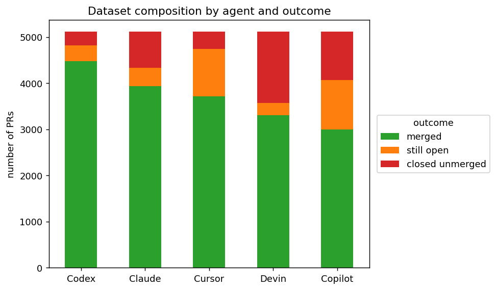
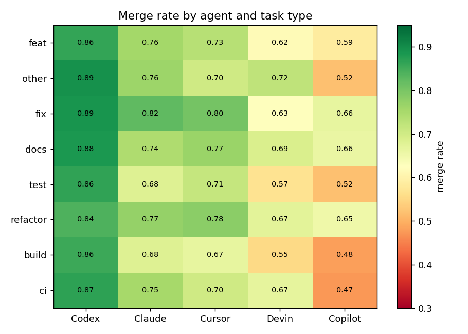
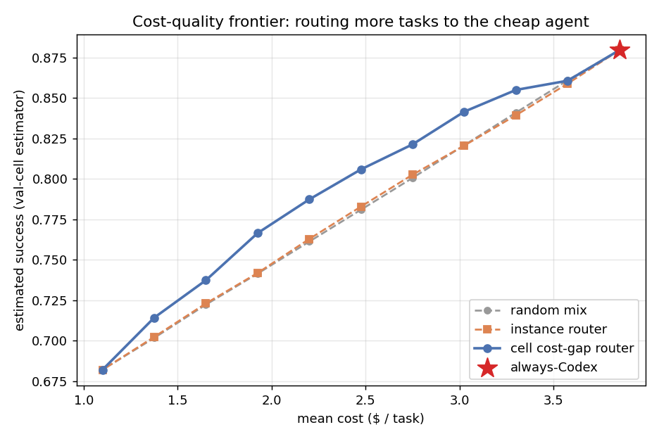
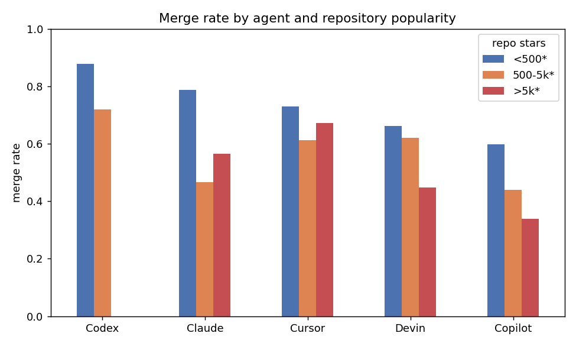
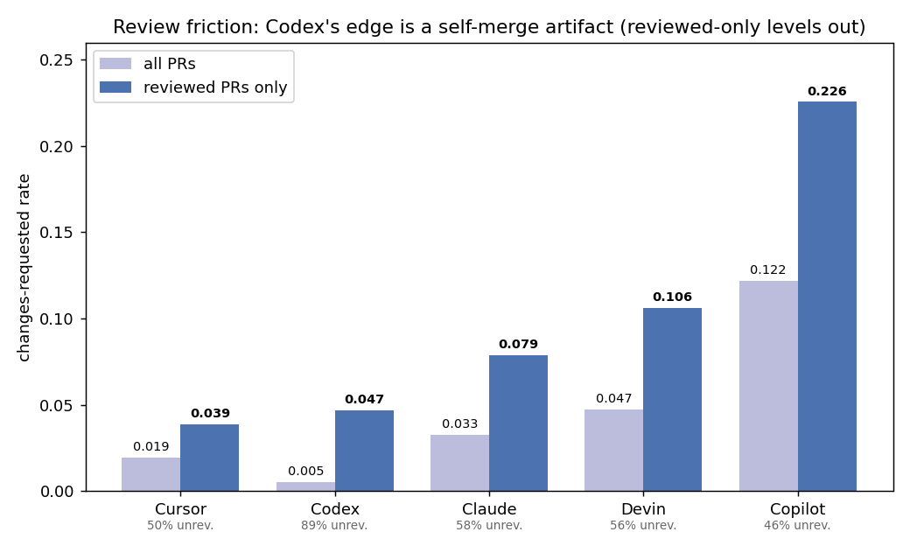
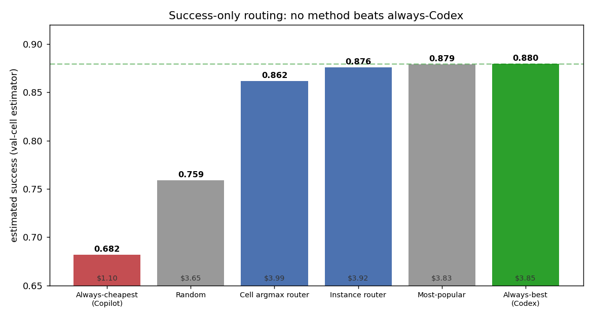
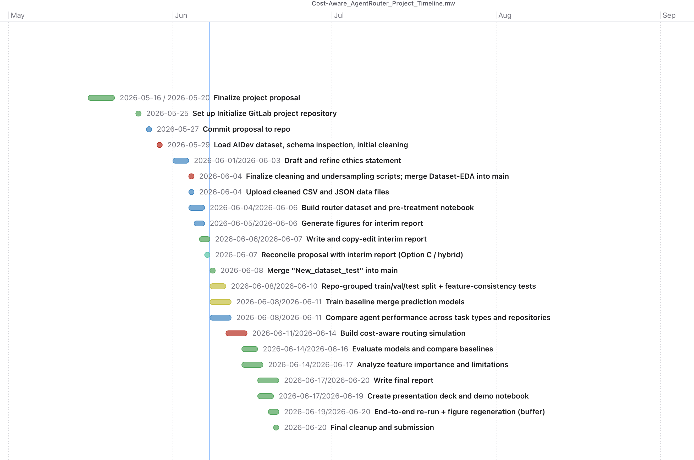

# Cost-Aware AgentRouter: Interim Report

**Course:** Summer 2026 CSC 504 **Group 13**
**Team:** Ziming Dong, Nhan Huynh, Ming Chen, Jason Thomo

---

## 1. Introduction, Motivation & Research Questions

AI coding agents such as Codex, Devin, Copilot, Cursor, and Claude Code now routinely open pull requests on public GitHub. Their subscription and usage costs differ several-fold (Section 3.5), yet teams usually pick one agent out of habit. We ask whether that choice can be made better. We frame it as a cost-aware router: given a task, score each agent's expected success and pick the agent that maximizes success net of cost. We study the question offline on AIDev, a large dataset of agentic pull requests.

Our main result is a negative one. On success alone, no learned router beats an always-best-agent policy, and that baseline itself turns out to be an artifact of selection bias rather than evidence of agent quality. Routing adds value only on the cost axis, where a simple cell-level router saves real cost for a modest loss in success. This report contributes:

- an end-to-end 5-agent cost-aware routing pipeline on AIDev (a balanced 25,580-PR corpus, an XGBoost model with agent-as-input, and a held-out off-policy estimator);
- evidence that the strong always-best-agent baseline is confounded by selection bias and a self-merge workflow rather than by agent capability (Sections 4.4 to 4.5);
- a cost–quality frontier on which a cell cost-gap router gives the best available trade-off (Section 4.3).

Research questions (from the proposal):

- RQ1. Do the five agents show measurably different merge rates across task categories?
- RQ2. How accurately can a regressor predict per-agent success from task and repository proxy features?
- RQ3. Can a cost-aware router improve the cost–quality trade-off over always-best-agent, and which routing signal achieves it?

## 2. Related Work & Background

*Cost-aware LLM and agent routing.* A line of work learns to route queries among models of different cost and quality. RouteLLM [Ong et al. 2025] trains a binary router between a strong and a weak model; Hybrid LLM [Ding et al. 2024] casts the same problem as quality-aware query routing; and FrugalGPT [Chen et al. 2024] cascades models to cut inference cost while preserving accuracy. All three report that learned routing beats an "always use the strongest model" policy on the cost–quality trade-off. Their evaluations, though, are on short-form QA, summarization, and reasoning, not on long-horizon software tasks. They also route over a shared input where a near-counterfactual signal is available, which is exactly what the observational AIDev setting lacks (Section 5).

*Empirical studies on agentic PRs (AIDev).* The AIDev dataset [Li et al. 2026 and follow-ups] has been used in a number of empirical studies of agentic pull requests, covering security, test contribution, code survival, and review themes. That work describes what agents do and how well they do it, but it treats agent identity as a descriptive variable rather than as a decision. We instead treat the agent as the quantity to be chosen.

*JIT defect and merge prediction.* A methodologically adjacent line predicts per-commit or per-PR outcomes. Ni et al. (2024) predict defects without modeling which author produced the change. Adding agent identity, as we do, shows that merge is a noisy, confounded label dominated by per-agent base rates (Section 5).

---

## 3. Methods and Datasets

### 3.1 Dataset

We use AIDev [Li et al. 2026], read through DuckDB. We build the corpus from the full dump of about 932k agent PRs rather than the smaller "pop" subset, which holds too few minority-agent PRs to train a 5-agent router (Claude_Code has 459, Cursor 1,541). The steps:

1. Filter to the five agents; require a `repo_id` and non-empty task text.
2. Label each PR from `state` and `merged_at` (Section 3.2).
3. Join repository metadata (`language`, `forks`, `stars`).
4. Derive `task_type` (a conventional-commit rule on the title), `has_issue` (`related_issue` linkage), and a partially stripped `body_clean` (footers, URLs, and agent tokens removed, but emails and some tool names remain; used only in the v1 leaky analysis).
5. Balance by down-sampling each agent to the smallest count (Claude_Code, 5,116), giving **25,580 PRs, 5,116 per agent**. Down-sampling keeps each agent's natural outcome distribution, which carries the routing signal. Built by `build_router_dataset.py`, written to `data/router_dataset.jsonl`.

***Figure 1.** Outcome distribution per agent (balanced corpus). Per-agent merge rates vary widely (Codex 87.6%, Claude 77.0%, Cursor 72.6%, Devin 64.6%, Copilot 58.6%), and the still-open versus closed-unmerged structure varies with them (Devin 30% closed-unmerged; Copilot 21% still-open), which points to differing workflows.*

| split (repo-grouped 70/15/15) | rows |
|---|---|
| train | 18,188 |
| val | 3,497 |
| test | 3,895 |

### 3.2 Labels

We model a regression target `success in {merged: 1.0, still_open: 0.3, closed_unmerged: 0.0}`. *Limitation (to revisit):* `still_open` is right-censored rather than "0.3 of a success", and open-rates differ by agent, so the 0.3 heuristic can bias the agent ranking. A binary or censored treatment is planned (Section 6).

### 3.3 Features (two regimes)

The AIDev `title` and `body` are the agent-authored PR, produced after the agent acts. They are post-treatment and not available at routing time, so we report two feature regimes:

- *v1 (initial, leaky).* An earlier version used the PR title plus `body_clean` (frozen MiniLM embeddings, chunked for long text), body-derived difficulty (length, code-block count, stack-trace flag), repo metadata, and `task_type`. This regime contains post-treatment leakage, which is what motivated v2.
- *v2 (reduced-leakage, `05_router_pretreatment.ipynb`).* Drops the PR body and every body-derived feature; it uses the cleaned `title` (agent tokens stripped) as a reduced-leakage task proxy, plus repo metadata (`language`, log `stars`, log `forks`), `has_issue`, and `task_type`. The title is itself agent-authored, so this is reduced-leakage rather than strictly pre-treatment.

In both regimes the agent identity is an input one-hot feature, not the prediction target.

### 3.4 Model and routing

A single XGBoost regressor learns `f(task features, agent) -> success`, an implicit table `P(success | task, agent)`. To route, we score all five agents for a task, holding the base features fixed and swapping only the agent one-hot, then pick an agent. The success-only policy picks `argmax_a P(success | x, a)`; the cost-aware policy picks `argmax_a [ P(success | x, a) - lambda * cost(a) ]`.

The cost-aware objective is conceptual here. Copilot is the only agent cheaper than Codex, so the reported frontier is a Codex-to-Copilot budget sweep (an increasing fraction of tasks moved to Copilot) rather than a literal five-agent lambda grid.

We compare two signals for choosing *which* tasks to move. The **instance router** uses the XGBoost model's per-task estimate. The **cell** signal uses a per-(language × task_type) estimate of each agent's historical success, and we apply it two ways: a success-only **cell argmax router**, and a **cell cost-gap router** that ranks tasks by the cell's Copilot-minus-Codex success gap (Section 4.3). We also ran an encoder ablation (MiniLM, mpnet, and a code-aware model) and tested per-agent calibration (Section 4).

The routing policies and baselines compared throughout the report are:

| routing policy | how it chooses an agent |
|---|---|
| **Always-best (Codex)** | always the highest historical-success agent |
| **Always-cheapest (Copilot)** | always the cheapest agent (the cost anchor) |
| **Random** | a random agent |
| **Most-popular** | the agent most used for the task's cell in the real-world distribution |
| **Instance router** | argmax of the XGBoost per-task success estimate |
| **Cell argmax router** | argmax of the cell's historical per-agent success |
| **Cell cost-gap router** | moves the tasks whose cell has the smallest Copilot-minus-Codex success gap |

### 3.5 Cost model

The five agents bill on different bases (token API for Codex and Claude, request/credit for Copilot, ACU for Devin, a backend-model pool for Cursor), so we use a **normalized marginal per-PR cost scenario** rather than exact vendor billing. Token-priced agents are sized by an agentic-PR budget (600k input, 200k output) at public API rates; the rest are mapped to an approximate per-PR cost:

| agent | Copilot | OpenAI_Codex | Cursor | Devin | Claude_Code |
|---|---|---|---|---|---|
| $ / PR | 1.10 | 3.85 | 3.85 | 4.50 | 4.80 |

Basis: Codex from GPT-5.3-Codex ($1.75 / $14 per MTok); Claude from Sonnet ($3 / $15); Cursor is backend-model dependent, with the base using a Codex-class rate; Devin is two ACUs at $2.25; Copilot uses its request/credit pricing.

*Limitations:* these are scenario costs, not exact billing. The token-priced values depend on the budget assumption and the request/ACU/backend-priced ones on the billing model, and we do not scale cost by task size (the `log(forks)` proxy collapses because 74% of repos have zero forks). A fuller pricing sweep and task-size scaling are left to future work.

### 3.6 Splits and evaluation

Splits are grouped by `repo_id` so that no repo crosses train, validation, or test, and all encoders are fit on the training split only.

Instance-level counterfactual evaluation is impossible here. In `related_issue`, only **5 issues** were attempted by two or more distinct agents, so we almost never observe two agents on the same task. We therefore use a subgroup direct-method estimator. We estimate each agent's success per (language × task_type) cell on the **held-out validation** cells, then use those estimates to value each policy's test-set choices. Scoring on validation cells, rather than on the training cells that the cell-based router routes by, makes the estimate **less circular**. It is not fully independent, since the model's early stopping also uses validation; bootstrap confidence intervals are planned (Section 6).

We evaluate the routers (Section 3.4) against four baselines (Section 4.5, Table 2, Figure 6):

- **random**: a random agent;
- **always-cheapest**: always Copilot, the cost anchor;
- **most-popular**: the agent most used for the task's cell in the real-world distribution, reconstructed by undoing the per-agent down-sampling;
- **always-best-agent**: always Codex.

*Planned (Section 6):* a time-based split, IPW, and bootstrap CIs.

---

## 4. Findings

### 4.1 RQ1: agents differ by task category

Merge rates differ sharply across agents (Figure 2). Across the eight most common task types, Codex ranges from 84% to 89%, against 48% to 66% for Copilot, so RQ1's premise, that the agents are not interchangeable, holds. The leader barely changes with granularity: Codex has the highest merge rate in each of those eight task types. Only small or fine-grained slices favour another agent (tiny task categories such as `perf` or `chore`, or a minority of (language × task_type) cells), and that edge is small and does not survive out-of-sample (Sections 4.5 and 4.6). The heterogeneity is real in level but weak as a routing signal, which Section 4.4 ties to selection bias.

***Figure 2.** Merge rate by agent across the eight most common task types. Codex has the highest merge rate in each; the gap to the other agents is wide, and the leading agent does not change across these categories.*

### 4.2 RQ2: per-agent success is only marginally predictable

The model barely beats a per-agent-mean baseline, and encoder capacity or type does not help. The encoder ablation below runs under the **leaky v1 feature set** (it includes the post-treatment PR body, so these MAEs are optimistic):

| v1 leaky encoder ablation | test MAE |
|---|---|
| MiniLM | 0.305 |
| mpnet-base (110M) | 0.307 |
| code-aware (st-codesearch) | 0.297 |

Even with that leakage the best encoder (0.297) barely improves on the per-agent-mean baseline below, and encoder type or size hardly moves it. The honest, **reduced-leakage v2** model is what we report everywhere else:

| reduced-leakage v2 model | test MAE |
|---|---|
| per-agent-mean baseline | 0.331 |
| v2 (cleaned title + repo) | 0.306 |
| v2 (repo metadata only, no text) | 0.309 |

*Takeaway:* most of the predictive power comes from the agent identity; the task text contributes little (dropping it moves MAE only from 0.306 to 0.309), and bigger or code-aware encoders do not change that. The ceiling is the data signal, not the model.

### 4.3 RQ3: a cell cost-gap router improves the cost–quality frontier

On success alone, no learned router beats always-best-agent. Under the held-out validation-cell estimator, the instance router scores 0.876 and the cell argmax router 0.862, both below always-Codex at 0.880. A text-free model collapses to always-Codex, and dropping the leaked body features left test MAE essentially unchanged at 0.306, so the task text was never carrying the decision. The value of routing is therefore on the **cost** axis.

Saving cost means sending some tasks to the only cheaper agent, Copilot, at $1.10 against Codex's $3.85. Copilot is weaker on average, so the question is *which* tasks to send. We compare three ways to choose, scored at matched cost (Figure 3):

- **random mix** sends a random fraction to Copilot;
- **instance router** sends the tasks the XGBoost model rates closest between the two agents;
- **cell cost-gap router** sends the tasks whose (language × task_type) cell has the smallest historical Copilot-minus-Codex gap, that is, the cells where the cheap agent loses least.

| mean cost | random | instance router | cell cost-gap router |
|---|---|---|---|
| $3.85 (always-Codex) | 0.880 | 0.880 | 0.880 |
| $3.30 (14% cheaper) | 0.841 | 0.839 | **0.855** |
| $2.75 (29% cheaper) | 0.801 | 0.803 | **0.821** |
| $2.20 (43% cheaper) | 0.761 | 0.763 | **0.787** |

***Figure 3.** Estimated success at matched cost (held-out validation-cell estimator). The instance router is no better than a random mix, because the text signal is too weak to pick tasks. The cell cost-gap router buys about two extra points of success at every cost level (for example 0.821 against 0.803 at 29% lower cost). The frontier still slopes down, so cost savings come at a real success cost, but the cell cost-gap router gives the best available trade-off.*

In cost-versus-best terms, the cell cost-gap router keeps about **93% of always-Codex's success** (0.821 against 0.880) **at 29% lower cost** ($2.75 against $3.85), and about 97% (0.855) at 14% lower cost.

### 4.4 Why always-Codex is so strong: selection bias and review intensity

always-Codex simply inherits Codex's high observed success (87.6% merged, Figure 1), the highest of the five and highest in nearly every cell. This is largely selection bias rather than proven capability (Figure 4):

***Figure 4.** 99% of Codex PRs sit in `<500★` repos (and none in `>5k★`), exactly where merge rates are highest for every agent. Codex's fast self-merge outcome structure (88% merged, 6% closed) contrasts with Copilot's formal-review pattern (21% still-open). The lead persists under star-difficulty adjustment (Codex's merge rate is about 14 percentage points above the rate expected from its PRs' repo-popularity buckets), so the confound is more likely the unobserved self-merge workflow than repo popularity alone.*

**The advantage is review-driven.** Changing the quality metric exposes the same confound. On the pop subset (which carries review data), Codex also looks strongest on several raw diagnostics (clean-merge rate, changes-requested rate, review burden, commit count), but these diagnostics are review-confounded: 89% of its PRs are never reviewed (self-merged), against 46 to 58% for the others, and an unreviewed PR cannot accumulate changes-requested. Restricting to PRs that *were* reviewed, Codex's edge collapses and Cursor is at least as clean (Figure 5):

| changes-requested rate | all PRs | reviewed PRs only |
|---|---|---|
| Cursor | 0.019 | **0.039** |
| Codex | 0.005 | 0.047 |
| Claude | 0.033 | 0.079 |
| Devin | 0.047 | 0.106 |
| Copilot | 0.122 | 0.226 |

***Figure 5.** Among reviewed PRs, Codex no longer leads: Cursor has the lowest changes-requested rate (0.039 against Codex's 0.047, within noise). Codex's raw "quality" is an artifact of 89% of its PRs going unreviewed.*

So the agent ranking depends on the quality metric: under a review-friction metric that controls for self-merge, Cursor (which trails Codex on raw merge rate) matches or edges it. We treat this as directional rather than conclusive (pop subset only, observational, a small within-noise gap, and which PRs get reviewed is itself non-random), and flag richer quality labels as future work.

### 4.5 Baselines: "best" and "most-popular" are the same agent

A richer baseline suite (Table 2, Figure 6) shows that the always-best-agent baseline is numerically close to a most-popular one. The most-popular baseline routes each task to the agent most frequently used for its (language × task_type) cell in the real-world distribution, reconstructed by undoing the per-agent down-sampling. It sends 99% of tasks to Codex and scores 0.879, essentially equal to always-Codex at 0.880. In other words, the most-used agent and the most-successful agent are the same agent.

Neither learned router exceeds it: the instance router scores 0.876 and the cell argmax router 0.862. Both occasionally route to pricier agents, so they even cost slightly more than always-Codex (Table 2). Always-Codex therefore dominates them on both success and cost. Always-cheapest (Copilot) anchors the cheap end at 0.682 and $1.10.

| baseline | success | mean $ | Codex share |
|---|---|---|---|
| Always-cheapest (Copilot) | 0.682 | 1.10 | 0% |
| Random | 0.759 | 3.65 | 20% |
| Cell argmax router | 0.862 | 3.99 | 77% |
| Instance router | 0.876 | 3.92 | 92% |
| Most-popular (raw usage) | 0.879 | 3.83 | 99% |
| Always-best (Codex) | 0.880 | 3.85 | 100% |

***Table 2.** Success-only routing, scored on the held-out validation-cell estimator. No learned router beats always-Codex; the cell argmax router's value shows up only under cost pressure (Section 4.3). An in-sample cell oracle reaches 0.93 but is circular (Section 4.6).*

***Figure 6.** Success-only routing (held-out validation-cell estimator). Always-best (Codex) and most-popular coincide at about 0.88 (both route about 99% to Codex), so the strong baseline conflates quality with popularity; no learned router beats it on success alone.*

### 4.6 Negative results that strengthen rigor

- Removing leakage (v2) did not overturn the negative routing result; it made it sharper.
- Per-agent calibration did not help: it left routing success essentially unchanged (and slightly worse in the earlier v1 setup), so we did not adopt it.
- The cell signal does not help success-only routing: the cell argmax router (0.862) stays below always-Codex (0.880), and an in-sample cell oracle reaches 0.93 only because it is circular. The cell signal pays off only under cost pressure (Section 4.3).

---

## 5. Discussion

*Contrast with cost-aware LLM routing.* RouteLLM, Hybrid-LLM, and FrugalGPT report that learned routing dominates an "always strongest" policy on cost and quality. On the success axis for long-horizon software tasks we find the opposite: a learned router does not beat always-best-agent. The difference is the data-generating process. Those works route over a shared input with a near-counterfactual signal, whereas AIDev is purely observational. Each task is attempted by exactly one agent (only 5 multi-agent issues), agent assignment is non-random, and "merged" is a workflow-confounded proxy. Our value, like theirs, shows up on the cost axis (Figure 3), in line with FrugalGPT's cost-for-quality trade-off, though here deeper savings carry a real, not negligible, success cost.

*Contrast with AIDev empirical studies.* Prior AIDev work treats agent identity descriptively. Treating it as a decision variable shows the decision is dominated by one agent whose apparent superiority is heavily confounded (Sections 4.4 and 4.5). What looks like an agent-quality ranking is largely a usage and selection pattern, so the result is cautionary rather than deployable.

*Contrast with JIT defect and merge prediction.* Adding agent identity confirms that merge is a noisy, confounded label; per-agent base rates dominate the weak task-text (title-proxy) signal.

*Methodological takeaway.* The binding constraints are the lack of counterfactual overlap and the selection bias, and no encoder, architecture, or calibration change overcomes them. This positions the work as an observational, reduced-leakage feasibility study of agent routing on AIDev.

*Threats to validity.* Merge is not the same as quality; the `still_open=0.3` label censors; the cost token-budget is an assumption; the direct-method estimator assumes within-cell exchangeability (no IPW or CIs yet); the population shifts to all repos, including 0-star ones; and `task_type` is rule-based (about 27% fall into "other").

---

## 6. Conclusions

We built an end-to-end 5-agent cost-aware routing pipeline on AIDev: a balanced 25,580-PR corpus, an XGBoost model with agent-as-input, a held-out-cell off-policy estimator, and a cost-aware cell cost-gap frontier. Agents do differ by task (RQ1), but a learned router cannot beat always-best-agent on success. That result is robust to removing post-treatment leakage, and it is largely explained by the selection bias documented in Section 4.5, where the "best" agent turns out to be simply the most-used one. The router's value is confined to the cost–quality frontier (RQ3): a **cell cost-gap** router gives the best available trade-off, about two points more success than a random or instance router at the same cost. It keeps about 93% of always-Codex's success at 29% lower cost, though going cheaper still costs real success.

We will frame the final report as an observational, reduced-leakage feasibility study rather than a deployable per-task router. Planned work: (i) a time-based split with IPW and bootstrap confidence intervals; (ii) a censored or binary treatment of `still_open`; (iii) a token-budget cost sensitivity sweep; (iv) quality labels beyond merge (review friction, reverts, tests), since the agent ranking is metric-dependent (Section 4.4); and (v) ideally counterfactual or online A/B data, the only real fix for the overlap problem.

---

## References

- Li, Zhang, and Hassan (2025). *The Rise of AI Teammates in Software Engineering (SE) 3.0: How Autonomous Coding Agents Are Reshaping Software Engineering.*
- Li, Zhang, and Hassan (2026). *AIDev: Studying AI Coding Agents on GitHub.*
- Ong et al. (2025). *RouteLLM: Learning to Route LLMs with Preference Data.*
- Chen, Zaharia, and Zou (2024). *FrugalGPT: How to Use Large Language Models While Reducing Cost and Improving Performance.*
- Ding et al. (2024). *Hybrid LLM: Cost-Efficient and Quality-Aware Query Routing.*
- Jimenez et al. (2024). *SWE-bench: Can Language Models Resolve Real-World GitHub Issues?*
- Cui et al. (2024). *The Effects of Generative AI on High-Skilled Work: Evidence from Three Field Experiments with Software Developers.*
- *Understanding Dominant Themes in Reviewing Agentic AI-authored Code.*
- He and Garcia (2009). *Learning from Imbalanced Data.*
- Ni et al. (2024). *Just-in-time defect prediction on JavaScript projects: A replication study.*
- Menzies and Shepperd (2019). *Bad Smells in Software Analytics Papers.*

*More routing and cascading references, author/year for the four AIDev follow-up entries, and full BibTeX (venues, DOIs) will be added in the final report.*

## Appendix: Artifacts & reproducibility

`build_router_dataset.py` (dataset build), `05_router_pretreatment.ipynb` (the reduced-leakage pipeline), and `make_figures.py` (regenerates Figures 1 to 6 and the reported numbers; Figure 5 additionally reads `pr_reviews`). Data read from `hf://datasets/hao-li/AIDev` through DuckDB.

---

## Updated Project Timeline

***Updated timeline / Gantt chart (revised 2026-06-07), with remaining tasks.** Items before the early-June marker are complete: the proposal, data cleaning, the balanced 25,580-PR router dataset, the reduced-leakage v2 model, the figures, and this interim report. Remaining tasks run to the 2026-06-20 submission: baseline merge-prediction training and agent comparison, the cost-aware routing evaluation and baseline comparison, feature-importance and limitation analysis, the final report, the presentation deck and demo notebook, and a buffer end-to-end re-run with figure regeneration before final cleanup and submission.*
